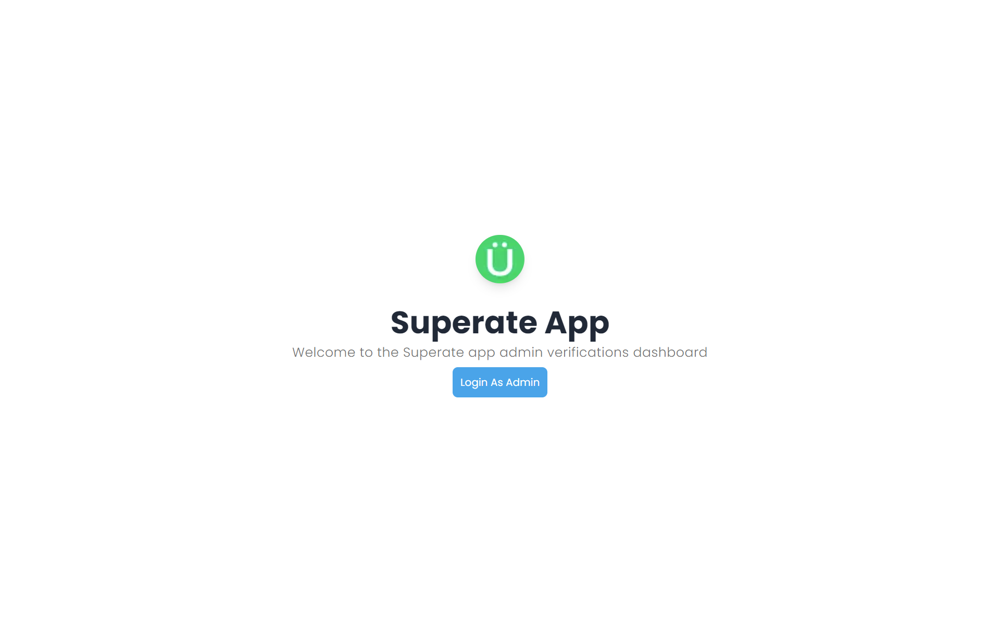
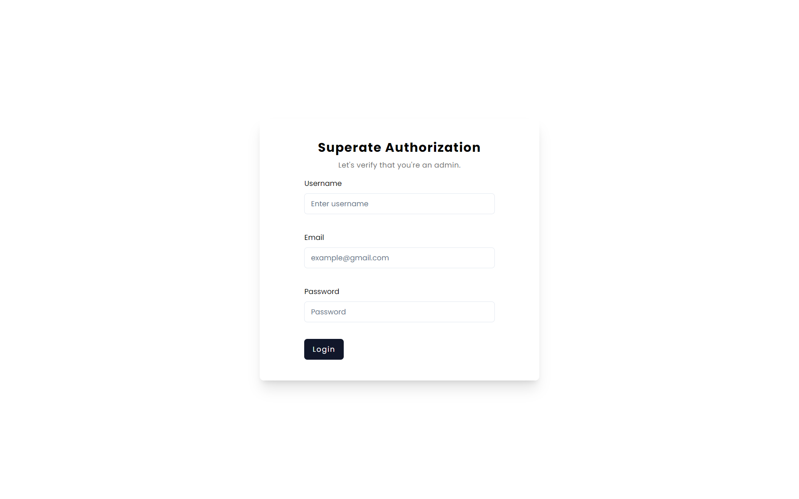
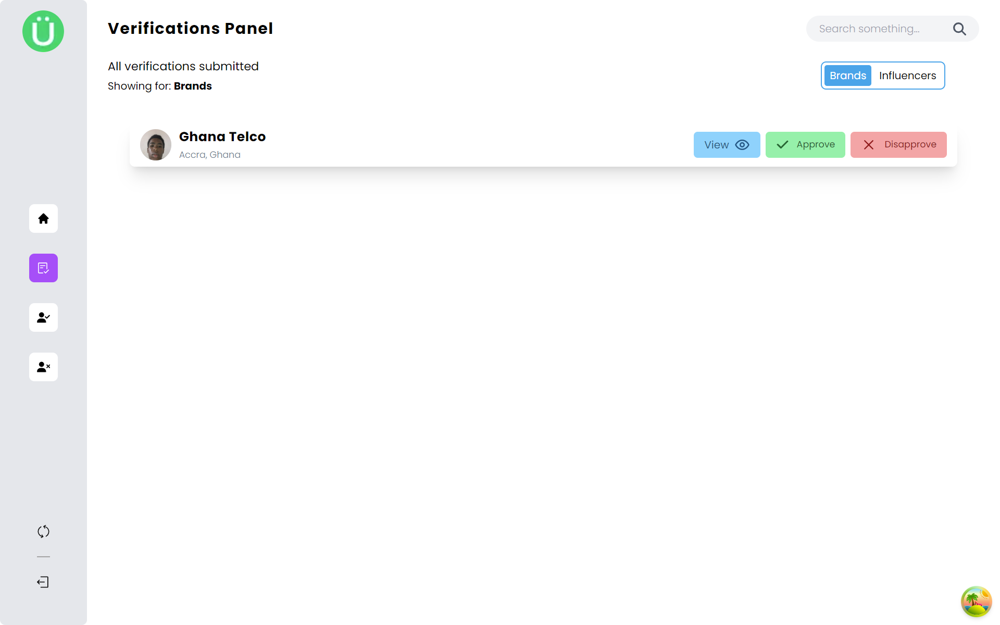
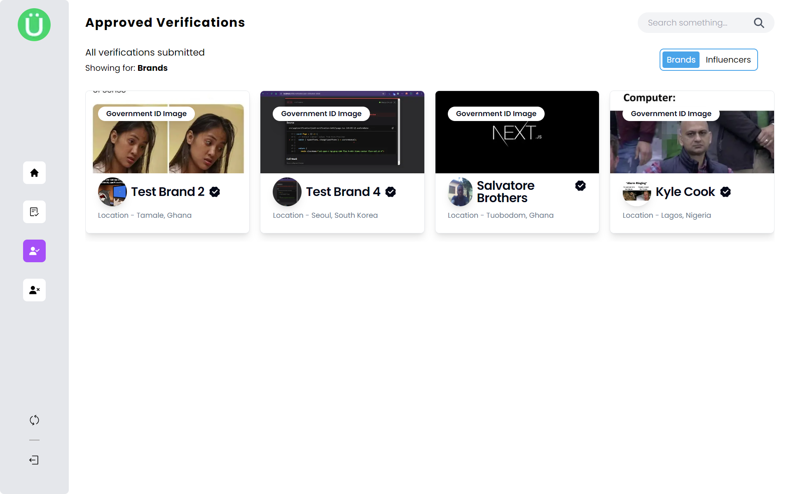
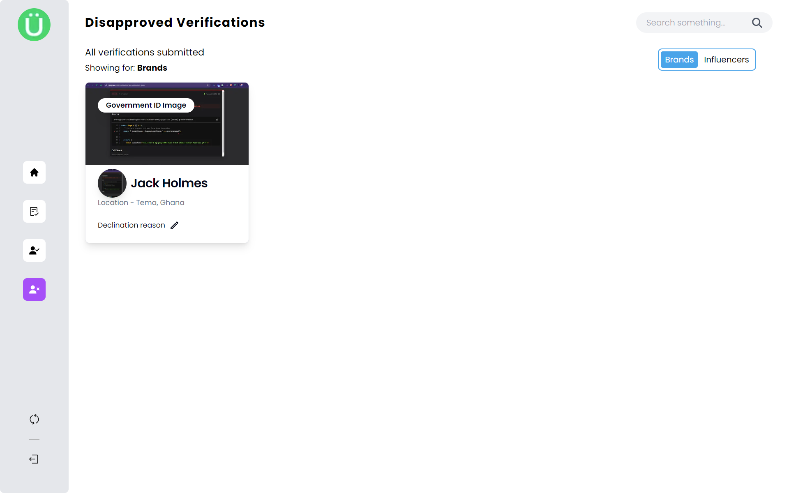
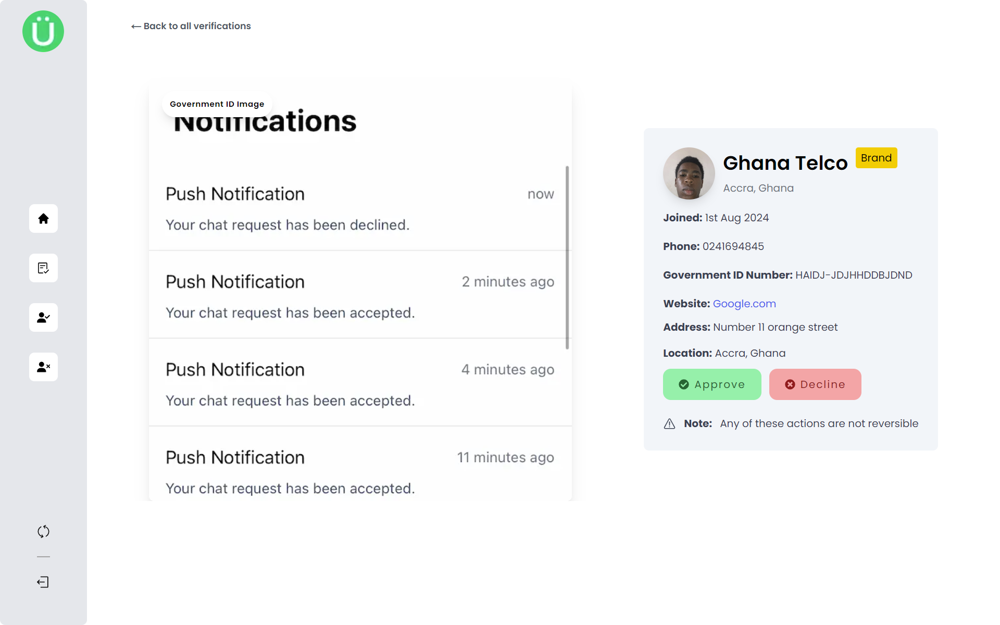
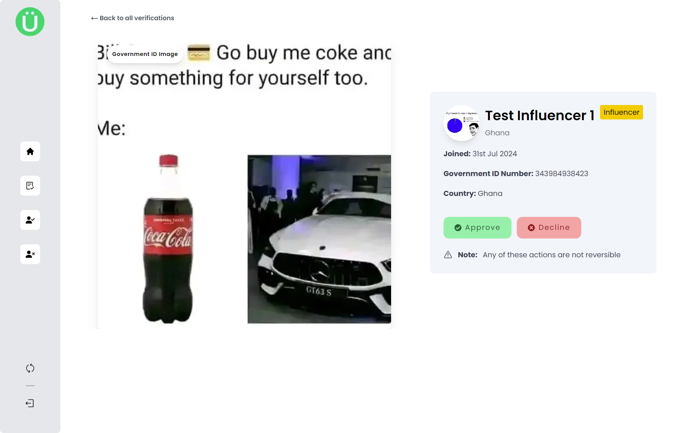
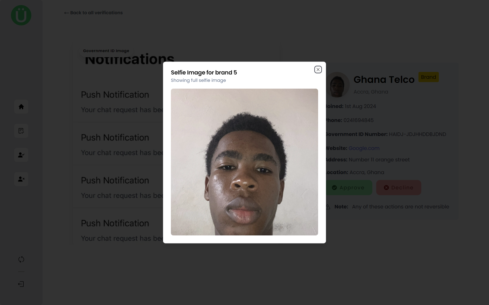

# Superate Verifications Platform
This is the official documentation for the superate admin verifications platform for brands and influencers from [Superate](https://www.superate.app). This platform will allow brands and influencers signed up to Superate to either be approved or disapproved.

## Features of this platform 
- Contains a page that showcases all submitted verifications
- Ability to approve and disapprove brands or influencers joining the app
- Ability to view a single brand or influencer via a dedicated page.
- Access to selfie image and government issued ID image from single view page
- Access to all approved brands or influencers
- Access to all disapproved brands and influencers

## Screenshots from the app
1. Below is a shot of the landing page

---

_This landing page displays a log in button when there is currently no user but displays a button to go straight to the admin verifications-overview if a user is logged in._

2. A screen shot of the login page

---

_This page ensures that the user is authenticated before going to admin dashboard itself_

3. The verifications overview page

---

_This page gives a quick view of all influencers and brands waiting to be approved or disapproved_

### Things to see and do here ([Verifications overview page](#screenshots-from-the-app)) 
-  A sidebar for quick navigation between different pages

- A refresh token button, which when clicked should refresh the access token when expired. (**_NB: This button must only be clicked when it shows on the UI that there are no verifications when there actually are. After that refresh the page to see the verification logs if any_**)

- A logout button to log currently signed user's out by resetting the tokens assigned to them client-side.

-  A search bar to quickly search for a verification data you're interested in.

- A switch to change between which verification logs to see, either brands or influencers.

- A log bar showing the verification data (some of it) and call-to-action buttons to either view, approve, or disapprove the verification detail.

4. Approved verifications page 

---

_This page gives a quick view of all verification data ever approved on the platform_

5. Disapproved verifications page 

---

_This page gives a quick view of all verification data ever approved on the platform. Also this page allows you to edit the declination reason for the disapproved brand or influencer_

**Note: The approved and disapproved verifications page have the functionality of switching between brands and influencers just as the verifications overview page.**

6. Single brand verifications page

---

_This page allows you to view a **brand** verification data into details by showing information like the date they joined the app, their phone number etc._

6. Single brand verifications page

---

_This page allows you to view an **influencer** verification data into details by showing information like the date they joined the app, their phone number etc._

7. Selfie image view pop-over modal

---

_Finally, this allows you to view a brand or influencer's selfie image in full view via a modal._

### Built for the  [Superate App](https://www.superate.app)

**_Superate - Monetize your following!_**

